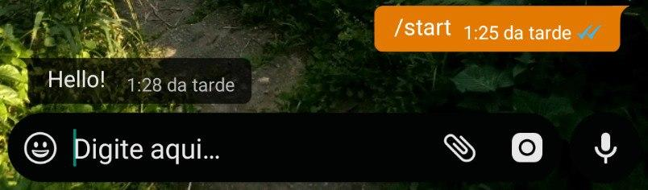

# ZapBot Master

* * *
[]()
[]()

----
<p align="center"><strong>Versão 1.0</strong></p>
<p align="center"><strong>A simple bot using whatsapp web, selenium and python 3.</strong></p>

**Settings**

* Clone the repository: ```git clone https://github.com/francis-taylor/zapbot.git```
* Enter the repository: `cd zapbot`

**Dowload ChromeDriver**

* Open ```https://chromedriver.chromium.org/downloads``` and download the file according to your version of chrome.

* Open the ```config.py``` file and place the chromedriver path in the ```path``` field and put the name of the contact that the bot should answer in the ```contact``` field.

**Install selenium webdriver**

* Type ```pip3 install selenium``` or ```python3 -m pip install selenium``` in the terminal and wait to install.

**starting the bot**

* After configuring the bot correctly, just type ```python3 bot.py```

**Commands**

* Type ```/start``` and bot return "Hello!"

<p align="center"></p>

* Type ```/media``` and bot return a media.

<p align="center"></p>

add yourself, more commands in the ```bot.py``` file.
